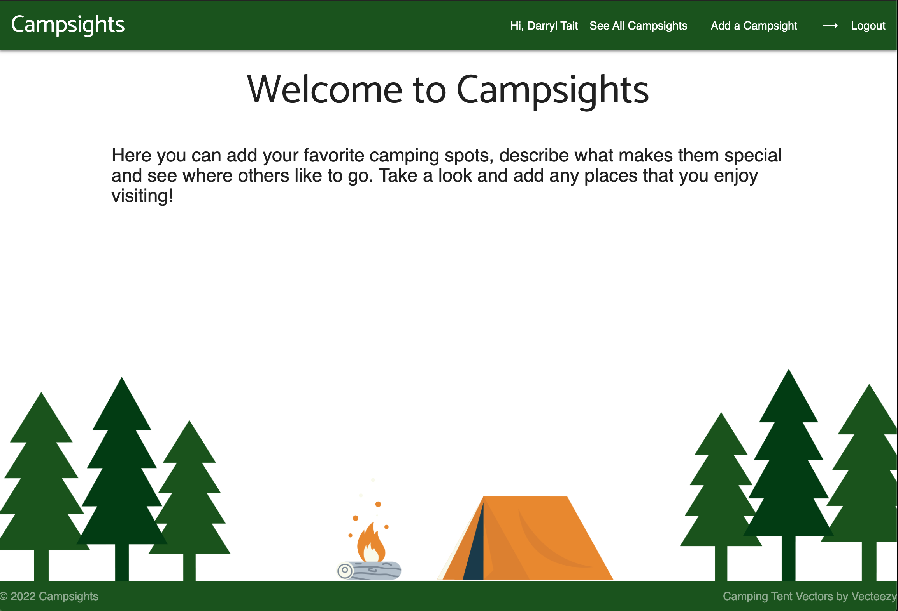
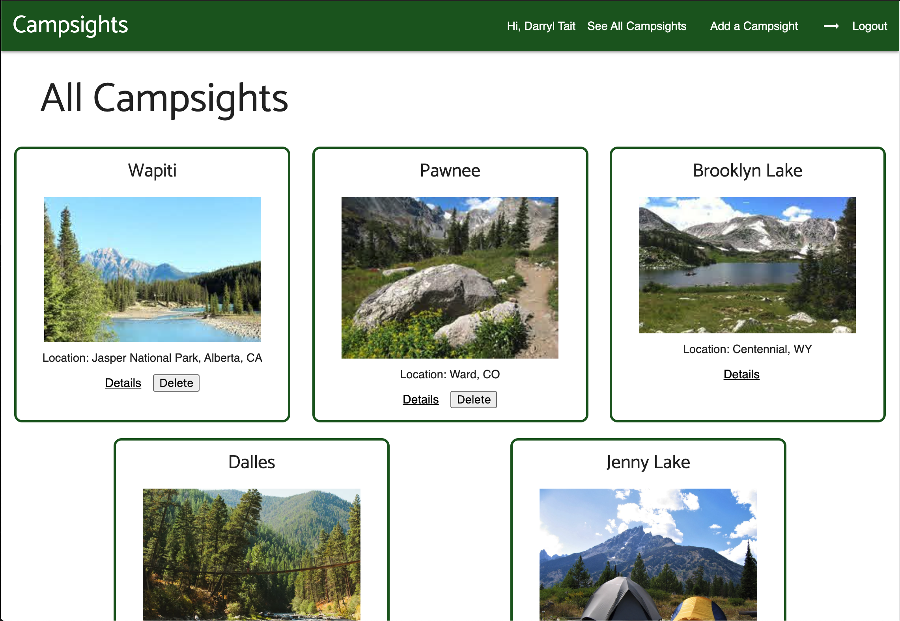

# Campsights

Campsights is an app that shows you where others like to go camping and let's you share your favorite places as well.

## Screenshots of app:

Main page

Index page

## Technologies Used

- HTML5
- CSS3
- JavaScript
- Node.js
- Mongoose
- MongoDB
- Heroku
- OAuth w/ Google
- Google Fonts
- Materialize

## Getting Started

Link to site:
https://campsights.herokuapp.com/

Trello planning:
https://trello.com/b/RU4DuiiF/campsights

## Next Steps

- Allow users to leave comments
- Make sizes of images uniform
- Add a default image when none are provided
